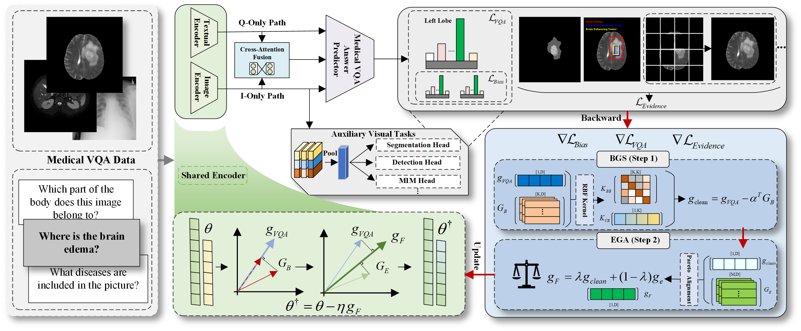

# Causal Gradient Intervention for Debiased and Evidence-Grounded Medical Visual Question Answering

## Overview

Medical Visual Question Answering (Med-VQA) integrates medical image understanding with clinical language reasoning to automatically answer natural-language questions grounded on medical images. While recent deep learning methods have achieved strong performance on standard Med-VQA benchmarks, they often struggle to provide query-consistent and verifiable visual evidence. Under scarce evidence-level supervision and biases induced by imbalanced data distributions, models can over-rely on shortcut signals from language priors and visual priors, replacing critical visual evidence with prior-driven cues and consequently distorting both predicted answers and evidence.

This repository provides the official implementation of **DE-CaGI**, a causal gradient intervention framework that achieves debiased learning and evidence grounding at the optimization level. DE-CaGI constructs auxiliary branches to characterize shortcut learning, explicitly estimates bias gradients driven by language and visual priors, and suppresses shortcut-related gradient components when updating the backbone representation module. Building on the debiased updates, DE-CaGI further introduces visual evidence gradients induced by multitask evidence supervision and imposes evidence-consistency constraints on the backbone update direction, guiding the model toward representations aligned with annotated evidence while reducing shortcut effects. Experiments on VQA-RAD and SLAKE demonstrate stable improvements on both open-ended and closed-ended questions, competitive overall accuracy, and better qualitative evidence alignment. The overall architecture of the proposed method is depicted in the figure below.

<div  align="center">    

</div>


## Requirements
```bash
pip install -r requirements.txt 
```

## Project Structure
```bash
├── checkpoints
├── dataset
│   ├── slake
│   │   ├──imgs
│   │   ├──train.json
│   │   ├──valid.json
│   │   ├──test.json
│   ├── rad
│   │   ├──....
│   │   ├──....
├── main
├── tain
├── test
```
## Data Preparation

### Datasets

1. Download the datasets.
   1. SLAKE: An English-Chinese bilingual Med-VQA benchmark containing 642 radiology images (CT, MRI, X-ray) and 14 ,028 question-answer pairs, plus pixel-level masks and a medical knowledge graph; download: https://www.med-vqa.com/slake/.
   2. VQA RAD: A clinician-curated dataset built from MedPix that provides 315 radiology images and 3 ,515 question-answer pairs for visual question answering; download: https://osf.io/89kps/.  
2. Place the files under the `dataset/` directory.


## Train & Test

```bash
# cd this file 
python main.py
# cd this file
python test.py
```

## Features

- **Optimization-level debiasing**: estimate bias gradients driven by language/visual priors and suppress shortcut-related components during backbone updates.

- **Evidence-grounded updates**: introduce visual evidence gradients induced by multitask evidence supervision (e.g., detection / segmentation / other evidence tasks) and constrain update directions for evidence consistency.
- **Plug-and-play**: works with common Med-VQA pipelines (image encoder + text encoder + fusion / decoder).
- **Benchmarks**: validated on VQA-RAD and SLAKE, improving open-ended, closed-ended, and overall accuracy with better evidence alignment.

## Result

|  Metheds   |        Venue         |                |    VQA-RAD     |                |      |                |     SLAKE      |                |
| :--------: | :------------------: | :------------: | :------------: | :------------: | :--: | -------------- | :------------: | :------------: |
|            |                      |      Open      |     Closed     |    overall     |      | Open           |     Closed     |    overall     |
|  MEVE-BAN  |      MICCAI’19       |     40.33      |     73.90      |     59.20      |      | 75.19          |     71.49      |     77.66      |
|  MEVE-SAN  |      MICCAI’19       |     39.57      |     72.92      |     58.09      |      | 74.57          |     77.88      |     75.87      |
|    M3AE    |      MICCAI’22       |     63.10      |     83.31      |     75.40      |      | 79.83          |     86.30      |     82.37      |
| PubMedCLIP |       EACL’23        |     60.10      |     80.00      |     72.10      |      | 78.40          |     82.50      |     80.10      |
|  VG-CALF   |  Neurocomputing’25   |   67.00±0.47   |   85.50±0.38   |   76.10±0.96   |      | 81.40±0.24     |   83.80±0.43   |   83.30±0.13   |
|  UnICLAM   |       MedIA’25       |     59.80      |     82.60      |     73.20      |      | 81.10          |     85.70      |     83.10      |
|    CKRA    |        TMI’25        |   67.43±0.98   | **85.83±0.55** |   78.84±0.44   |      | 81.20±0.23     | **89.82±0.26** |   84.37±0.16   |
|   DeBCF    |      MICCAI’23       |   58.60±1.10   |   80.90±0.80   |   71.60±1.00   |      | 80.80±0.90     |   84.90±0.70   |   82.60±0.90   |
|  Tri-VQA   |       BIBM’24        |     60.34      |     82.72      |     73.84      |      | 81.55          |     85.58      |     83.13      |
|  MedCFVQA  | VLM4Bio (at  ACL'24) |       -        |       -        |     56.30      |      | -              |       -        |     85.11      |
| CCIS-MVQA  |        TMI’24        |   68.78±0.23   |   79.24±0.16   |     75.06      |      | 80.12±0.11     |   86.72±0.07   |     84.08      |
|  DE-GaCI   |         Ours         | **69.94**±0.19 |   84.93±0.21   | **78.98**±0.08 |      | **84.48**±0.14 |   88.72±0.17   | **86.21**±0.11 |

## Future Work

-  Scale DE-CaGI to larger and more open-ended Med-VQA benchmarks across institutions, modalities, and answer spaces.
- Expand weak and pseudo evidence supervision (e.g., self-training, report-derived cues) to reduce reliance on scarce annotations.  
- Refine the intervention with finer gradient decomposition and adaptive suppression/injection across layers, tokens, and regions.
- Strengthen cross-modal evidence consistency with tighter region–text alignment objectives for more verifiable evidence grounding.

## Contributing

We welcome pull requests and issues!

## License

This project is licensed under the MIT License. See the [LICENSE](https://opensource.org/license/MIT) file for details.


## Contact

**First Author**: Bing Liu, Kunming University of Science and Technology Kunming, Yunnan CHINA, email: LB_violet2023@outlook.com

**Corresponding Author**: Lijun Liu, Ph.D., Kunming University of Science and Technology Kunming, Yunnan CHINA, email: cloneiq@kust.edu.cn

